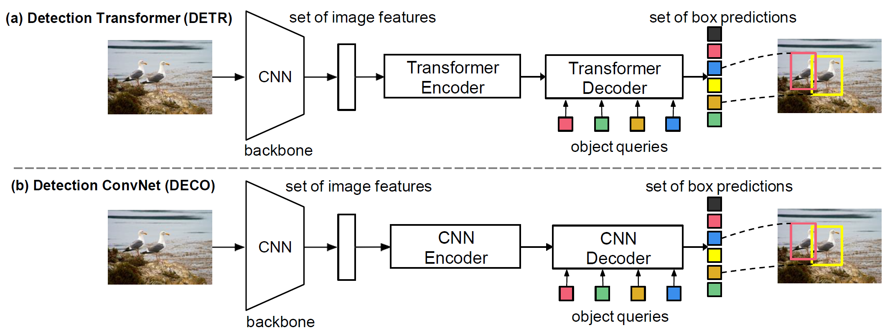

# Contents

- [Contents](#contents)
    - [DECO Description](#deco-description)
    - [Model architecture](#model-architecture)
    - [Environment Requirements](#environment-requirements)
    - [Dataset](#dataset)
    - [Eval process](#eval-process)
        - [Usage](#usage)
        - [Launch](#launch)
        - [Result](#result)
    - [ModelZoo Homepage](#modelzoo-homepage)

## [DECO Description](#contents)

We proposed Detection ConvNet (DECO), which is a simple yet effective query-based end-to-end object detection framework. Our DECO model enjoys the similar favorable attributes as DETR. We compare the proposed DECO against prior detectors on the challenging COCO benchmark. Despite its simplicity, our DECO achieves competitive performance in terms of detection accuracy and running speed. Specifically, with the ResNet-50 and ConvNeXt-Tiny backbone, DECO obtains 38.6% and 40.8% AP on COCO val set with 35 and 28 FPS respectively. We hope the proposed DECO brings another perspective for designing object detection framework.

> [Paper](https://arxiv.org/abs/2312.13735): DECO: Query-Based End-to-End Object Detection with ConvNets.
> Xinghao Chen, Siwei Li, Yijing Yang, Yunhe Wang.

## [Model architecture](#contents)

Our DECO is composed of a backbone and convolutional encoder-decoder architecture. We carefully design the DECO encoder and propose a novel mechanism for our DECO decoder to perform interaction between object queries and image features via convolutional layers. ConvNeXt blocks are used to build our DECO encoder. The DECO decoder can be divided into two components, i.e., Self-Interaction Module (SIM) and Cross-Interaction Module (CIM). In DETR the SIM and CIM is implemented with multi-head self-attention and cross-attention mechanism, while in our proposed DECO, the SIM is stacked with simple depthwise and 1 × 1 convolutions. We further propose a novel CIM mechanism for our DECO to perform interaction between object queries and image features via convolutional layers as well as simple upsampling and pooling operations.




## [Environment Requirements](#contents)

- Hardware(Ascend/GPU)
    - Prepare hardware environment with Ascend or GPU.
- Framework
    - [MindSpore](https://www.mindspore.cn/install/en) >= 1.9
- For more information, please check the resources below
    - [MindSpore Tutorials](https://www.mindspore.cn/tutorials/en/master/index.html)
    - [MindSpore Python API](https://www.mindspore.cn/docs/en/master/api_python/mindspore.html)


## [Dataset](#contents)

Dataset used: [COCO2017](https://cocodataset.org/#download)

- Dataset size：~19G
    - [Train](http://images.cocodataset.org/zips/train2017.zip) - 18G，118000 images
    - [Val](http://images.cocodataset.org/zips/val2017.zip) - 1G，5000 images
    - [Annotations](http://images.cocodataset.org/annotations/annotations_trainval2017.zip) -
      241M，instances，captions，person_keypoints etc
- Data format：image and json files
    - The directory structure is as follows:

```text
├── annotations  # annotation jsons
├── test2017  # test data
├── train2017  # train dataset
└── val2017  # val dataset
```


## [Eval process](#contents)

### Usage

After installing MindSpore via the official website, you can start evaluation as follows:

### Launch

```bash
# infer example python with single GPU
bash scripts/run_eval_gpu.sh [DEVICE_ID] [CFG_PATH] [SAVE_PATH] [CKPT_PATH] [DATASET_PATH]
```
The checkpoint with ResNet-50 backbone can be downloaded at https://github.com/xinghaochen/DECO/releases/download/1.0/deco_r50_150e_mindspore.ckpt.

### Result

```bash
Results of DECO with ResNet-50 backbone:
IoU metric: bbox
 Average Precision  (AP) @[ IoU=0.50:0.95 | area=   all | maxDets=100 ] = 0.388
 Average Precision  (AP) @[ IoU=0.50      | area=   all | maxDets=100 ] = 0.588
 Average Precision  (AP) @[ IoU=0.75      | area=   all | maxDets=100 ] = 0.411
 Average Precision  (AP) @[ IoU=0.50:0.95 | area= small | maxDets=100 ] = 0.199
 Average Precision  (AP) @[ IoU=0.50:0.95 | area=medium | maxDets=100 ] = 0.431
 Average Precision  (AP) @[ IoU=0.50:0.95 | area= large | maxDets=100 ] = 0.556
 Average Recall     (AR) @[ IoU=0.50:0.95 | area=   all | maxDets=  1 ] = 0.320
 Average Recall     (AR) @[ IoU=0.50:0.95 | area=   all | maxDets= 10 ] = 0.522
 Average Recall     (AR) @[ IoU=0.50:0.95 | area=   all | maxDets=100 ] = 0.556
 Average Recall     (AR) @[ IoU=0.50:0.95 | area= small | maxDets=100 ] = 0.297
 Average Recall     (AR) @[ IoU=0.50:0.95 | area=medium | maxDets=100 ] = 0.607
 Average Recall     (AR) @[ IoU=0.50:0.95 | area= large | maxDets=100 ] = 0.798
```

## [ModelZoo Homepage](#contents)

Please check the official [homepage](https://gitee.com/mindspore/models).